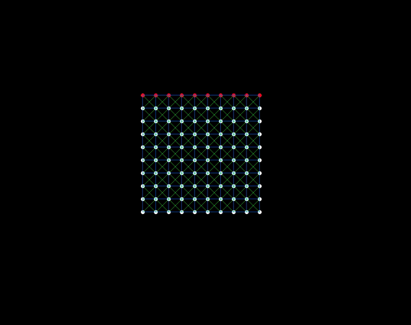
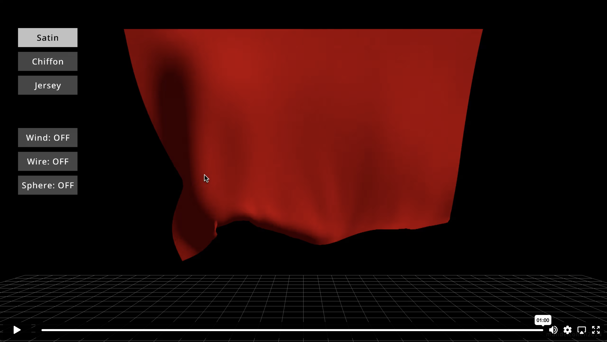

<h1 align="center">Cloth Simulation</h1>
<h3 align="center">Exploring PBD for real-time cloth simulation.</h3>
<h3 align="center">By Mandel Cohen, 2024</h3>
 

## Introduction
The objective of this project was to develop an in-depth understanding of Position-Based Dynamics (PBD) and cloth simulation by creating a custom physics engine capable of producing  realistic, visually engaging cloth behaviour in real-time. Drawing on my background in textiles, my focus was on capturing the nuanced “feel” and drape of various fabric types.

In addition to the physical simulation, I explored shader techniques to enhance the visual quality of the fabrics by incorporating fabric specific properties. My aim was to create an interactive demo that brings close to life with both physical accuracy in aesthetic detail. This demo showcases, various fabric types, interactivity, and dynamic affects presenting cloth as a believable and immersive element within a visual environment.
  

## Weeks 1-3: Laying the Foundation

### Research
The project began with intensive research, gathering resources on key topics such as:
* Position-Based Dynamics (PBD)
* Integration methods for physics simulations
* Shader programming
* Time step configuration

These initial weeks were dedicated to building a foundation in PBD and setting up the core simulation framework. I selected Raylib and C as the development environment, which allowed for efficient exploration of graphics programming and simulation.
 

### 2D Simulation and Picks System
I started with a 2D setup, implementing a system of points called “picks” (from the textile term “picks per inch”). Basic constraints such as structural constraints were introduced to maintain the cloth's form. To make the simulation interactive, I added:
* The ability to apply external forces via mouse key presses.
  

    

    
  
* Features to pin and unpin picks dynamically during the simulation.
   

    

   

As I added more constraints, such as bending and shear constraints, the simulation evolved to exhibit more cloth-like behaviour, moving away from the initial jelly-like appearance. Gradually, I refined my understanding of the underlying math and integration techniques.
  

### Fabric Properties 
I introduced a fabric properties system to define parameters like stiffness, mass, and damping. This allowed me to simulate different fabric types and tailor the behaviour of the cloth to mimic real-world materials.

  

    

    

## **Weeks 4-6: Expanding to 3D and Enhancing Interactivity**

### Transition to 3D
A major milestone was achieved in week four with the transition from 2D to 3D simulation. This involved generating a custom mesh for the cloth, significantly increasing the complexity and realism of the simulation. The mesh system laid the groundwork for adding dynamic interactions and effects.

 

    

   

### Sphere Interaction
I introduced a sphere that could interact with the cloth, simulating collisions. This feature added depth to the simulation and allowed for more engaging demonstrations of the cloth’s responsiveness. Understanding collision detection and response between the sphere and the cloth mesh became a key focus during this phase.

 

    

   

### Shaders and Visual Enhancements
To make the fabrics visually engaging, I explored shader programming, focusing on understanding normals and how they influence the appearance of light and shadow on the cloth. These experiments led to the creation of procedural shaders that highlighted the texture and shine of the fabrics, enhancing their lifelike qualities without relying on pre-made textures or normal maps.

 

    

   

### User Interface
To improve accessibility and usability, I developed a simple user interface. This UI enabled users to:
* Select different fabric presets as shown above.
* Toggle interactive tools:
  * Applying random wind forces:
     

    

   
  * Rendering as wireframe or solid:
  

    

   
  * Add a sphere collider that interacts with the cloth:

    

   

## Results and Reflections
By the end of the project, the simulation achieved a balance between physical realism and visual appeal. The cloth exhibited life-like draping, folding, and responsiveness to external forces, while the shaders added depth and texture to the materials. The interactive demo successfully showcased various fabric types and tools, creating an engaging and educational experience.

The iterative process of refining constraints, collision handling, and fabric properties deepened my understanding of both the physics and artistic aspects of cloth simulation. The project not only met its goals but also inspired further exploration into advanced topics such as compute shaders for performance optimisation and more complex fabric interactions.

### Watch on Vimeo by clicking the image below:

## Sources
**Papers:**
* Müller, Matthias, et al. *Position-Based Dynamics*.
* Jakobsen, Thomas. *Advanced Character Physics*. 
* Wu, Wayne Tzu-Wen. *Numerical Methods in Cloth Simulation*.

⠀
**Books and Literature:**
* Fletcher Dunn and Ian Parberry. *3D Math Primer Graphics and Game Development*.
* Millington, Ian. *Game Physics Engine Development*.
* Szuhay, Jeff. *Learn C Programming*.

⠀
**Online Resources:**
* *The Book of Shaders*. [https://thebookofshaders.com](https://thebookofshaders.com/)
* *Raylib.* [https://www.raylib.com](https://www.raylib.com/)

⠀

